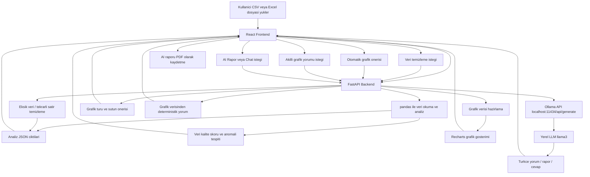

# Akilli Veri Analiz Asistani

CSV ve Excel dosyalarini analiz eden, grafiklerle gorsellestiren ve Ollama uzerinden yerel LLM ile Turkce yorumlar uretebilen modern bir veri analizi web uygulamasidir. Proje, veri gorsellestirme dersi kapsaminda React, FastAPI, pandas ve Recharts kullanilarak gelistirilmistir.

## Kisa Tanim

Kullanici bir veri dosyasi yukler. Backend dosyayi pandas ile analiz eder, frontend veriyi tablo ve grafik olarak gosterir. Kullanici isterse Ollama uzerinden AI rapor olusturabilir veya veri hakkinda sohbet alanindan soru sorabilir.

## Temel Ozellikler

- CSV, XLS ve XLSX dosyasi yukleme
- Yuklenen veriyi tablo olarak gosterme
- Satir, sutun, eksik veri ve sayisal sutun kartlari
- Ortalama, minimum, maksimum, medyan ve standart sapma hesaplama
- Bar, line, pie, scatter grafikler
- Korelasyon heatmap
- Grafik icin kullanici kontrollu sutun secimi
- Otomatik grafik onerisi
- Veri temizleme paneli
- Veri kalite skoru
- Anomali tablosu
- Ollama destekli Turkce AI rapor
- AI ile secili grafik yorumu
- AI raporu PDF olarak kaydetme
- Veri hakkinda Turkce chat alani
- Modern ve responsive dashboard arayuzu

## Mimari



## Girdiler ve Ciktilar

### Girdiler

- Veri dosyasi: `.csv`, `.xls`, `.xlsx`
- Grafik secimleri:
  - Grafik turu: bar, line, pie, scatter, heatmap
  - X sutunu
  - Y sutunu
- Ollama model adi:
  - Varsayilan: `llama3`
  - Ornek: `llama3:latest`, `mistral`, `gemma`
- Kullanici sorusu:
  - Ornek: `Bu veride en onemli trend ne?`
  - Ornek: `Hangi kategori daha iyi performans gosteriyor?`
- Veri temizleme islemi:
  - Eksik verileri doldurma
  - Eksik satirlari silme
  - Tekrarli satirlari silme

### Ciktilar

- Veri on izlemesi:
  - Ilk 500 kayit tablo olarak gosterilir.
- Otomatik analiz:
  - Satir sayisi
  - Sutun sayisi
  - Eksik veri sayisi
  - Tekrarli satir sayisi
  - Veri kalite skoru
  - Anomali kayitlari
  - Sayisal sutunlar
  - Kategorik sutunlar
  - Ortalama, minimum, maksimum, medyan ve standart sapma
- Grafikler:
  - Secilen sutunlara gore Recharts ile gorsellestirme
  - Sayisal sutunlar icin korelasyon heatmap
  - Veri tiplerine gore otomatik grafik onerisi
  - Secili grafik icin hesaplanan akilli yorum
- AI rapor:
  - Veri ozeti
  - Onemli bulgular
  - Trend analizi
  - Anomali ve eksik veri analizi
  - Riskler
  - Oneriler
  - Sonuc
  - Tarayici uzerinden PDF olarak kaydetme
- Chat cevabi:
  - Kullanici sorusuna Ollama tarafindan uretilen Turkce yanit

## Kullanilan Teknolojiler

- Frontend: React, Vite
- Stil: Tailwind CSS
- Grafikler: Recharts
- Backend: Python FastAPI
- Veri isleme: pandas, numpy, openpyxl
- LLM: Ollama API
- Baslatici: Python, keyboard, psutil

## Kurulum

### 1. Ollama

Ollama servisini baslatin:

```powershell
ollama serve
```

Varsayilan modeli indirin:

```powershell
ollama run llama3
```

### 2. Backend

```powershell
cd backend
pip install -r requirements.txt
uvicorn main:app --reload
```

Backend adresi:

```text
http://localhost:8000
```

### 3. Frontend

```powershell
cd frontend
npm install
npm run dev
```

Frontend adresi:

```text
http://localhost:5173
```

## F8 ile Hizli Baslatma

Windows icin eklenen baslatici scripti kullanmadan once proje ana klasorunde gerekli Python paketlerini kurun:

```powershell
py -m pip install -r requirements.txt
```

Ardindan yine proje ana klasorundeyken baslaticiyi calistirin:

```powershell
py start_with_f8.py
```

Terminalde `Uygulamayi baslatmak icin F8 tusuna basin` yazisini gordukten sonra klavyeden `F8` tusuna basin.

F8'e basildiginda script:

1. Backend calismiyorsa baslatir.
2. Frontend calismiyorsa baslatir.
3. 5 saniye bekler.
4. Tarayicida `http://localhost:5173` adresini acar.

Windows'ta F8 tusu algilanmazsa VS Code'u yonetici olarak calistirmak gerekebilir.

## Ornek Veri

Projede teknoloji satis verisi iceren ornek CSV bulunur:

```text
sample_data/teknoloji_satislari.csv
```

Uygulamayi hizlica test etmek icin bu dosyayi yukleyebilirsiniz.

## API Uclari

- `POST /upload`: CSV veya Excel dosyasi yukler.
- `GET /analyze`: Yuklenen veri icin otomatik analiz dondurur.
- `GET /charts`: Secilen grafik turu ve sutunlara gore grafik verisi dondurur.
- `GET /suggest-chart`: Veri tiplerine gore otomatik grafik onerisi dondurur.
- `POST /clean`: Secilen yonteme gore veri temizleme islemi uygular.
- `POST /report`: Ollama ile Turkce AI rapor uretir.
- `POST /ask`: Kullanici sorusunu veri baglami ile Ollama'ya gonderir.
- `POST /chart-comment`: Secili grafik icin grafik verisine dayali Turkce yorum uretir.
- `POST /warmup`: Secilen Ollama modelini arka planda hazirlar.

## Notlar

- AI rapor ve chat ozellikleri icin Ollama servisinin calisiyor olmasi gerekir.
- `llama3` ilk calistirmada yavas yanit verebilir.
- `llama3` 8B oldugu icin CPU uzerinde yavas yanit verebilir. Daha hizli AI yanitlari icin daha kucuk bir yerel Ollama modeli yuklenip ust bardaki model alanina yazilabilir. Ornek: `tinyllama`.
- Ollama kapaliysa uygulama su hatayi dondurur: `Ollama calismiyor. Lutfen 'ollama serve' calistirin.`
